<!-- ══════════════════════════════════════════════════════════════════════════════
                            NIKHILESH KAMALAPURKAR
     Every animation below is a hand-authored SVG in ./assets — no templates.
     ══════════════════════════════════════════════════════════════════════════ -->

<div align="center">
  
</div>

<div align="center">

<a href="https://www.linkedin.com/in/nikhileshkamalapurkar"></a>
<a href="mailto:kamalapurkarnikhilesh@gmail.com"></a>
<a href="https://github.com/Nikhileshhhh"></a>
<a href="https://brighter-brainzz.vercel.app"></a>
<br/>


</div>

<br/>

<div align="center">
  
</div>

<br/>

<!-- ═══════════════════════════════ NAVIGATION ═══════════════════════════════ -->

<div align="center">

### ⟨ pick a thread and pull ⟩

<a href="#-who-am-i"></a>
<a href="#-the-stack"></a>
<a href="#-where-ive-worked"></a>
<a href="#-things-ive-built"></a>
<a href="#-github-in-motion"></a>
<a href="#-receipts"></a>
<a href="#-lets-talk"></a>

</div>


<!-- ═══════════════════════════════ 01 · ABOUT ═══════════════════════════════ -->

## 🧬 Who am I

<div align="center">
  
</div>

<div align="center">
<table>
<tr>
<td width="33%" align="center">
  <h3>🏭</h3>
  <b>I build for the factory floor</b><br/>
  <sub>AI-assisted internal tooling at ABB —<br/>Angular, .NET, Docker, Azure DevOps</sub>
</td>
<td width="33%" align="center">
  <h3>🥇</h3>
  <b>I win when it counts</b><br/>
  <sub>1st of 1,400+ teams nationally,<br/>with a product judges could touch</sub>
</td>
<td width="33%" align="center">
  <h3>🚀</h3>
  <b>I ship to real users</b><br/>
  <sub>200+ people used RankShala in 14 days.<br/>Marketing budget: zero</sub>
</td>
</tr>
</table>
</div>

<details>
<summary><b>&nbsp;📖&nbsp; The longer version &nbsp;<sub>(click to expand)</sub></b></summary>

<br/>

I'm a final-year **B.Tech CSE (AI & ML)** student at the Institute of Aeronautical Engineering, Hyderabad, carrying a **GPA of 8.47/10** — but the part I'd rather be judged on is what I've put in front of real people.

I like problems where the *interesting* part isn't the model, it's the **trust**. ConfidenceOS came from a simple observation: industrial control rooms are drowning in alarms, but nobody is answering the more basic question — *should this reading be believed at all?* That reframing is what won a national hackathon against 1,400+ teams.

RankShala came from the opposite direction: not a hard technical problem, but a real one. Students and parents guess at college admissions with folklore. I turned official historical cutoff data into a prediction engine, wired up payments, shipped it, and watched 200+ people show up in two weeks without spending a rupee on ads.

Between those, I've been the person doing the unglamorous half too — CI/CD pipelines in Azure DevOps, row-level security policies, containerized builds, role-based auth, sprint ceremonies. **I ship v1, then I make it trustworthy.**

Outside the editor, I've co-run a tutoring program since 2021 that grew from **3 students to 70+**, and I captained a cricket team to a T20 semi-final with figures of 4-3-2-1. Both taught me more about shipping under pressure than any course did.

</details>

<details>
<summary><b>&nbsp;⚡&nbsp; The 15-second recruiter version &nbsp;<sub>(click to expand)</sub></b></summary>

<br/>

| | |
|---|---|
| **Currently** | AI Developer Intern @ ABB Global Industries and Services |
| **Graduating** | May 2027 · B.Tech CSE (AI & ML) · GPA 8.47/10 |
| **Best signal** | 1st place, ABB Accelerator National Hackathon — 1,400+ teams |
| **Proof of ownership** | Founded RankShala solo: product, backend, payments, users |
| **Core stack** | Java · Python · TypeScript · React · Angular · Node · .NET · FastAPI |
| **Infra** | Azure DevOps · Docker · AWS · CI/CD · Supabase · Firebase · Postgres |
| **Looking for** | AI/ML Engineering · Full-Stack · Product Engineering roles |
| **Location** | Hyderabad, India · open to relocation |
| **Reach me** | [kamalapurkarnikhilesh@gmail.com](mailto:kamalapurkarnikhilesh@gmail.com) · [+91 83320 70494](tel:+918332070494) |

</details>


<!-- ═══════════════════════════════ 02 · STACK ═══════════════════════════════ -->

## 🛰️ The stack

<table>
<tr>
<td width="46%" align="center">



</td>
<td width="54%" valign="middle">

**Languages**


**Frontend**


**Backend & data**


**Cloud, DevOps & tooling**


</td>
</tr>
</table>

<details>
<summary><b>&nbsp;🔧&nbsp; What I actually do with all of that &nbsp;<sub>(click to expand)</sub></b></summary>

<br/>

<table>
<tr>
<td valign="top" width="50%">

**⚙️ Engineering**

```diff
+ REST API design, versioning & integration
+ Role-based auth, sessions, form validation
+ Real-time data over WebSockets
+ Row-level security & server-authoritative APIs
+ Razorpay subscriptions across tiered plans
+ Containerized builds (Docker) for parity
+ Azure DevOps pipelines, work items, releases
```

</td>
<td valign="top" width="50%">

**🧠 AI & data**

```diff
+ Machine learning & model evaluation
+ Recommender and prediction systems
+ LLM-powered product features (Claude API)
+ Confidence / reliability scoring engines
+ Data analytics & visualization (Tableau)
+ Jupyter-driven experimentation
+ GitHub Copilot in the daily loop
```

</td>
</tr>
</table>

</details>


<!-- ═══════════════════════════════ 03 · EXPERIENCE ═══════════════════════════════ -->

## 🏢 Where I've worked

<details open>
<summary><b>&nbsp;🏭&nbsp; AI Developer Intern &nbsp;·&nbsp; ABB Global Industries and Services Pvt. Ltd.</b> &nbsp;&nbsp;<code>Jul 2026 → Present</code></summary>

<br/>

> **AU – Digital business** · Hyderabad

```
├── AI-assisted internal tooling
│   └── built and tested with GitHub Copilot, Docker and Azure DevOps
│       across the full development lifecycle
│
├── Full-stack application modules
│   ├── Angular + .NET
│   ├── responsive UI components
│   ├── REST service integrations
│   └── containerized builds → identical local and cloud deployments
│
└── Delivery ownership
    ├── source control + work items in Azure DevOps
    ├── CI/CD release pipelines
    └── code reviews, sprint planning, agile ceremonies with senior engineers
```

</details>

<details>
<summary><b>&nbsp;💻&nbsp; Frontend Web Developer &nbsp;·&nbsp; Callipus Solutions Pvt. Ltd.</b> &nbsp;&nbsp;<code>Apr 2025 → May 2025</code></summary>

<br/>

```
├── Fully responsive web application
│   ├── React.js · TypeScript · HTML5 · CSS3
│   └── clean, intuitive UI/UX → improved engagement and session retention
│
├── RESTful APIs for data handling
│   └── efficient client–server communication, modular backend integration
│
└── Secure authentication system
    ├── session management
    ├── form validation
    └── role-based access control protecting sensitive user data
```

</details>

<details>
<summary><b>&nbsp;🎓&nbsp; Co-Founder & Mentor &nbsp;·&nbsp; Brighter Brainzz</b> &nbsp;&nbsp;<code>2021 → Present</code></summary>

<br/>

Four years of running an actual small business alongside a degree.

- Grew the tutoring program from **3 students to 70+** across Grades 1–12.
- Designed the curriculum and personally mentored in **Maths & Science**.
- Built and deployed the platform → **[brighter-brainzz.vercel.app](https://brighter-brainzz.vercel.app)**

</details>


<!-- ═══════════════════════════════ 04 · PROJECTS ═══════════════════════════════ -->

## 🧪 Things I've built

### 🥇 ConfidenceOS — *an AI trust layer for industrial control rooms*

<div align="center">
  
</div>

<div align="center">

`React (Vite)` · `FastAPI` · `Python` · `WebSockets` · `SQLite` · `Claude API`

**🏆 1st place — ABB Accelerator National Hackathon · 1,400+ teams · 14,000+ participants**

</div>

> Control rooms don't lack alarms. They lack an answer to a simpler question:
> **can this reading even be trusted?**

<details>
<summary><b>&nbsp;🔬&nbsp; How it works &nbsp;<sub>(click to expand)</sub></b></summary>

<br/>

| Subsystem | What it does |
|---|---|
| 🎯 **Confidence scoring engine** | Computes a live **0–100% trust score** for every sensor reading from four independent signals — **calibration age**, **sensor stability**, **cross-sensor consistency** and **physical plausibility** — instead of leaning on alarm thresholds alone |
| ⚖️ **Mass Balance Cross-Check** | Applies **conservation-of-mass** principles across the process to expose hidden inconsistencies and physically impossible readings *before* they escalate into hazardous failures |
| 📊 **Operator dashboard** | An interactive React UI with live confidence indicators, **sensor health timelines** and a dedicated **startup safety mode** for the riskiest window in any plant's day |
| 🤖 **LLM shift handover** | Generates the shift handover report automatically, so the next operator inherits **context** rather than guesswork |

**Why it won:** most entries made the data prettier. ConfidenceOS made the data *accountable* — it tells an operator how much to believe their own instruments, which is the decision that actually precedes every other one.

</details>

<br/>

### 📈 RankShala — *founder & solo full-stack developer*

<div align="center">
  
</div>

<div align="center">

`React` · `Vite` · `Supabase (Auth + Postgres + RLS)` · `Edge Functions` · `Razorpay`

**Concept → live product → paying users. Built alone.**

</div>

> Students and parents guess at admissions using folklore.
> RankShala replaces the guessing with **official historical cutoff data**.

<details>
<summary><b>&nbsp;🏗️&nbsp; What's inside &nbsp;<sub>(click to expand)</sub></b></summary>

<br/>

Feed it a **rank, branch, category, gender and counselling round** — it returns a ranked list of best-fit colleges, drawn from official historical cutoffs across **JEE Main, JEE Advanced, TG EAPCET and AP EAMCET**.

- 📉 **Historical cutoff tracker** with interactive charts, plus college and exam comparison
- 📝 **Mock-test engine** with performance analytics and **PDF report generation**
- 🔐 **Supabase backend** — PostgreSQL with **row-level security** and server-authoritative APIs
- 💳 **Razorpay subscriptions** across a tiered **Free / Pro / Premium** model
- 📊 **100 users in the first 48 hours · 200+ within 2 weeks · entirely organic, ₹0 spend**

The traction is the part I'm proudest of: it means the product was right, not the promotion.

</details>

<br/>

<details>
<summary><b>&nbsp;📂&nbsp; More from my GitHub &nbsp;<sub>(click to expand)</sub></b></summary>

<br/>

<div align="center">

| Repository | Stack | What it is |
|---|---|---|
| **[movie-recommender-system](https://github.com/Nikhileshhhh/movie-recommender-system)** | `Python` | A personalized, AI-powered movie recommender |
| **[car-insurance-prediction](https://github.com/Nikhileshhhh/car-insurance-prediction)** | `Jupyter` | ML notebook predicting car-insurance outcomes |
| **[language-detection](https://github.com/Nikhileshhhh/language-detection)** | `Python` | Language identification from raw text |
| **[Fintrack](https://github.com/Nikhileshhhh/Fintrack)** | `TypeScript` | Personal finance tracking application |
| **[Expense-Tracker](https://github.com/Nikhileshhhh/Expense-Tracker)** | `TypeScript` | Expense management with a typed frontend |
| **[manahsara](https://github.com/Nikhileshhhh/manahsara)** | `Dart / Flutter` | Cross-platform mobile application |
| **[collegedetails-repo](https://github.com/Nikhileshhhh/collegedetails-repo)** | `JavaScript` | College data service behind admission tooling |
| **[JFS_VISEM](https://github.com/Nikhileshhhh/JFS_VISEM)** | `Java` | Java full-stack implementations |

<a href="https://github.com/Nikhileshhhh?tab=repositories"></a>

</div>

</details>


<!-- ═══════════════════════════════ 05 · STATS ═══════════════════════════════ -->

## 📡 GitHub in motion

<div align="center">


<br/>

**🐍 watch the snake eat my contributions**

<picture>
  <source media="(prefers-color-scheme: dark)" srcset="https://raw.githubusercontent.com/Nikhileshhhh/Nikhileshhhh/output/snake-dark.svg" />
  <source media="(prefers-color-scheme: light)" srcset="https://raw.githubusercontent.com/Nikhileshhhh/Nikhileshhhh/output/snake-light.svg" />
  
</picture>

</div>


<!-- ═══════════════════════════════ 06 · RECEIPTS ═══════════════════════════════ -->

## 🏅 Receipts

<table>
<tr><td width="70" align="center"><h2>🥇</h2></td><td>

**ABB Accelerator Hackathon — 1st Place, National Level**<br/>
Won against **1,400+ teams / 14,000+ participants** across India with **ConfidenceOS**, an AI trust layer that scores sensor-data reliability for industrial decision-making.

</td></tr>
<tr><td align="center"><h2>🥈</h2></td><td>

**TechSprint, GDG by TensorFlow — 2nd Place** &nbsp;<code>Jan 2026</code><br/>
Designed the UI architecture and **multi-agent workflow** for an AI research-curator tool, against top university teams.

</td></tr>
<tr><td align="center"><h2>🥈</h2></td><td>

**Youth Speak Ideathon — 2nd Place** &nbsp;<code>Oct 2025</code><br/>
Co-designed **DAANVEER**, an NGO crowdfunding platform — led prototype development and the final presentation under a hard deadline.

</td></tr>
<tr><td align="center"><h2>🧑‍🏫</h2></td><td>

**Co-Founder & Mentor, Brighter Brainzz** &nbsp;<code>2021 – Present</code><br/>
Scaled a tutoring program from **3 to 70+ students**, designed the curriculum, and deployed the platform.

</td></tr>
<tr><td align="center"><h2>🎯</h2></td><td>

**Tech Mentor, EDAM — IARE** &nbsp;<code>Sep 2025 – Present</code><br/>
Guiding peers through AI/ML fundamentals, project building and career development.

</td></tr>
<tr><td align="center"><h2>🏏</h2></td><td>

**Cricket Captain — State-Level Representative**<br/>
Led the school team to the T20 semi-finals with figures of **4-3-2-1**. IARE team player.

</td></tr>
</table>

<details>
<summary><b>&nbsp;📜&nbsp; Certifications &nbsp;<sub>(click to expand)</sub></b></summary>

<br/>

<div align="center">


<br/>


</div>

| Certification | Issuer | Date |
|---|---|---|
| GenAI Powered Data Analytics Job Simulation | TATA · Forage | Nov 2025 |
| Data Analytics Job Simulation | Deloitte · Forage | Oct 2025 |
| AI-ML Virtual Internship | AICTE | Jun 2025 |
| Cloud Foundations | AWS Academy | May 2025 |

</details>

<details>
<summary><b>&nbsp;🎓&nbsp; Education &nbsp;<sub>(click to expand)</sub></b></summary>

<br/>

| Institution | Qualification | Result | Completed |
|---|---|---|---|
| **Institute of Aeronautical Engineering**, Hyderabad | B.Tech — CSE *(AI & ML)* | **GPA 8.47 / 10.0** | Expected May 2027 |
| **Narayana Junior College**, Hyderabad | Intermediate | **95.2%** | May 2023 |
| **Kenbridge School**, Karnataka | CBSE | **78.8%** | Aug 2021 |

</details>


<!-- ═══════════════════════════════ 07 · CONTACT ═══════════════════════════════ -->

## 📬 Let's talk

<div align="center">

**Open to internships and full-time roles in AI/ML Engineering, Full-Stack Development and Product Engineering.**

I'm the person who gets v1 in front of real users, then makes it reliable enough to keep them.<br/>
If that's the shape of engineer your team is missing — the inbox is open.

<br/>

<a href="mailto:kamalapurkarnikhilesh@gmail.com"></a>
<br/>
<a href="https://www.linkedin.com/in/nikhileshkamalapurkar"></a>
<a href="https://github.com/Nikhileshhhh"></a>
<a href="tel:+918332070494"></a>

</div>

<br/>

<details>
<summary align="center"><b>&nbsp;🥚&nbsp; You scrolled all the way down here. Have an easter egg.</b></summary>

<br/>

```
   ╔══════════════════════════════════════════════════════════════════╗
   ║                                                                  ║
   ║   "The best systems don't just work —                            ║
   ║    they tell you when they shouldn't be trusted."                ║
   ║                                                                  ║
   ║   That sentence is the whole idea behind ConfidenceOS,           ║
   ║   and it's also how I think about writing software:              ║
   ║   confidence is a feature, not a vibe.                           ║
   ║                                                                  ║
   ║   Also — every animation on this page is a hand-written SVG      ║
   ║   in ./assets. No templates, no generators. I made the           ║
   ║   README the same way I make everything else.                    ║
   ║                                                                  ║
   ║                          ~ Nikhilesh                             ║
   ╚══════════════════════════════════════════════════════════════════╝
```

If you read this far, mention **"4-3-2-1"** in your first message and I'll know exactly where you found me. 🏏

</details>

<br/>

<div align="center">
  
</div>
